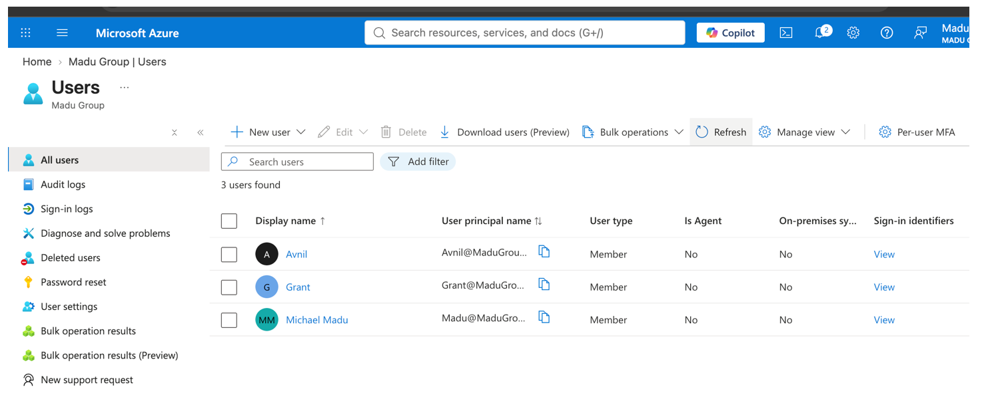
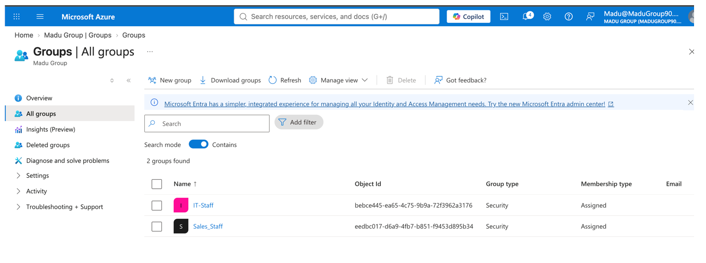
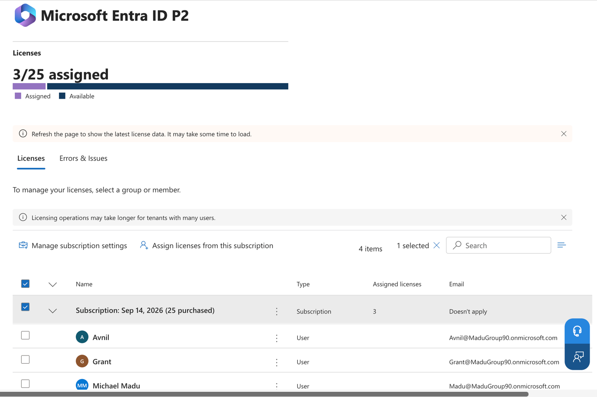
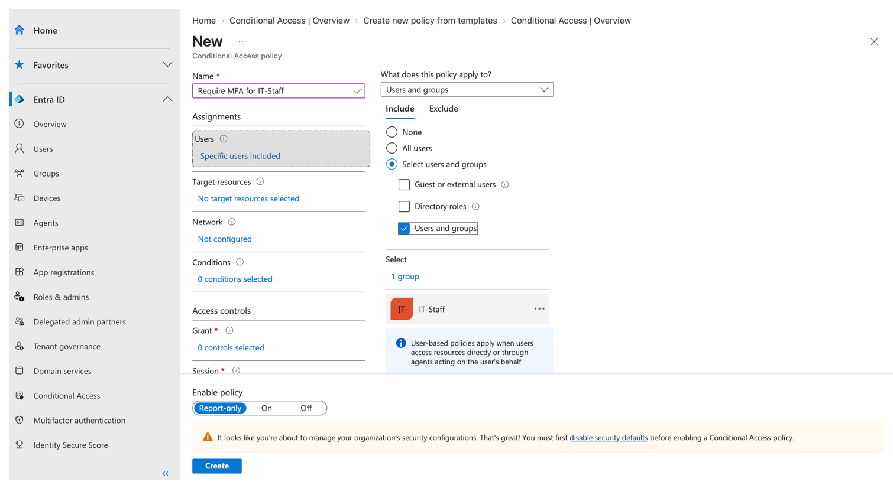
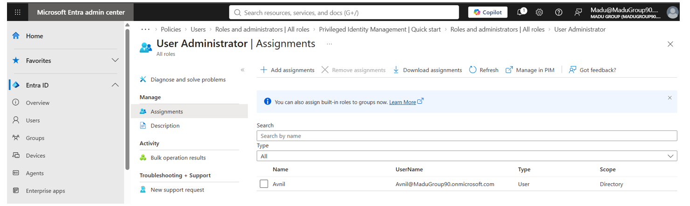
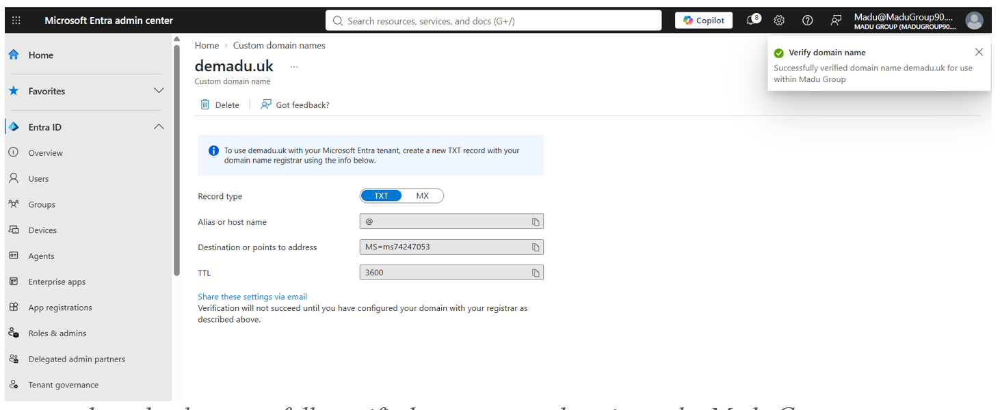

# Microsoft 365 / Entra ID Home Lab

## Overview

Built a cloud identity and access management environment in Microsoft Entra ID — the cloud-based counterpart to the on-prem Active Directory lab in this series. Where AD (Lab 1) controls access to machines physically reachable on a local network, Entra ID controls access to cloud services from anywhere, which is the actual mechanism that solves remote/hybrid workforce access.

**Tenant:** Madu Group (`MaduGroup90.onmicrosoft.com`), custom domain `demadu.uk` verified
**License:** Microsoft Entra ID P2 (trial)

## What was built

| Component | Details |
|---|---|
| Tenant | Microsoft Entra ID tenant "Madu Group," Global Administrator account |
| Custom domain | `demadu.uk` added and verified via DNS TXT record (Cloudflare) |
| Users | Test users representing IT department staff (Michael Madu — admin, Avnil, Grant) |
| Groups | IT-Staff and Sales_Staff security groups (Assigned membership), mirroring the department structure from the AD lab |
| Licensing | Microsoft Entra ID P2 trial activated and assigned to test users, to unlock Conditional Access |
| Conditional Access | Policy "Require MFA for IT-Staff" — scoped to the IT-Staff group only, all cloud apps, grant control: require MFA, deployed in **Report-only** mode first for safe validation |
| RBAC | Delegated the built-in **User Administrator** role to a test user (Avnil), separating day-to-day user management from the Global Administrator account |

## Why this matters (AD vs. Entra ID)

The on-prem AD lab (Lab 1) has a structural limitation: a device has to physically reach the domain controller to authenticate, which breaks down for remote workers without a VPN. Entra ID removes that constraint — identity lives in Microsoft's cloud, so authentication works from anywhere with no dependency on a specific network.

In a real hybrid deployment, **Microsoft Entra Connect** syncs on-prem AD accounts to Entra ID and enables single sign-on, so a user's DC01 login and their Entra ID login become one and the same. This lab intentionally didn't provision Entra Connect (it requires a domain-joined sync server, more infrastructure than the identity concepts themselves need) but the environments are understood and structured to support that bridge later.

## Screenshots

**Users and groups**

**Security groups**

**Entra ID P2 trial activated**

**Licenses assigned to test users**

**Conditional Access policy creation**

**Conditional Access policy — report-only**

**RBAC — delegated role**

**Custom domain verified**

## Conditional Access policy design notes

- Scoped to **IT-Staff only**, not "All users" — MFA friction is applied where the business risk (access to more sensitive systems) justifies it, rather than a blanket rule.
- The Global Administrator account was deliberately **excluded** from the policy to avoid a lockout scenario while testing.
- Deployed in **Report-only** mode rather than "On" — standard practice for validating a new access policy's real-world impact via sign-in logs before it actually blocks or challenges anyone.

## RBAC design notes

- Rather than leaving all administration on the single Global Administrator account, the narrower **User Administrator** role (create/manage users, reset passwords — no billing, security policy, or other-admin access) was delegated to a test user.
- This reflects least-privilege practice: giving people the access their job requires, not broader admin rights "just in case."

## What I'd do differently in production

- Provision **Microsoft Entra Connect** to sync with an on-prem AD (bridging Lab 1 and this lab), enabling single sign-on rather than fully separate credentials.
- Move the Conditional Access policy from Report-only to fully enforced once sign-in logs confirm it isn't catching anyone unintended.
- Layer in Identity Protection (risk-based sign-in policies) on top of Conditional Access, both covered by the P2 license already in use.
- Extend device compliance requirements (Intune) so Conditional Access can also check whether the *device*, not just the user, meets security standards before granting access.

## Skills demonstrated

Microsoft Entra ID administration, Conditional Access policy design, RBAC / least-privilege delegation, custom domain verification, cloud identity licensing, and articulating the architectural relationship between on-prem AD and cloud identity.
